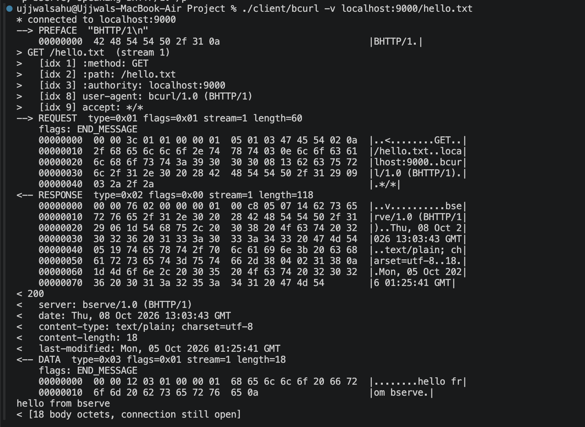
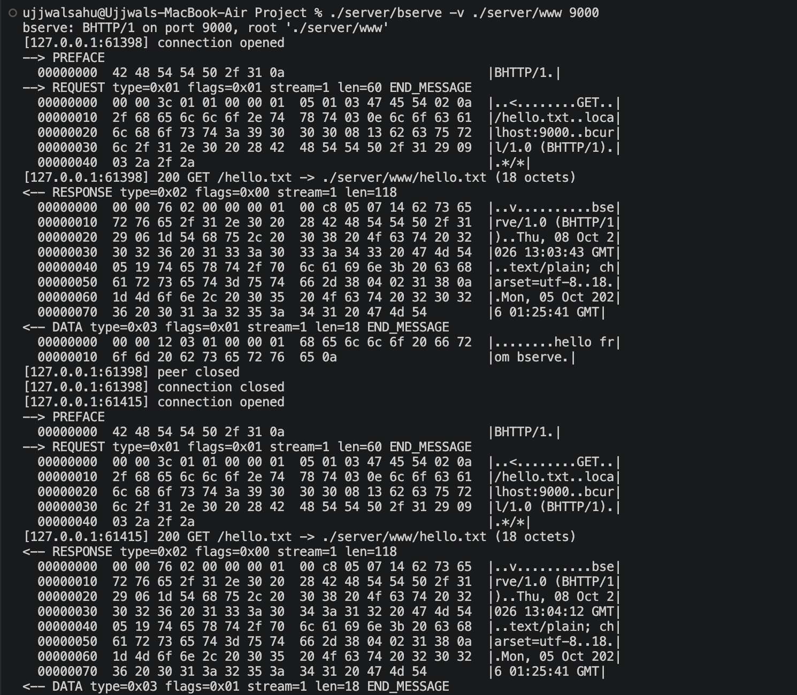

# Annotated hexdump — one complete binary-http request and response

Captured with a passthrough TCP tap sitting between
`bcurl` and `bserve`, not bytes written by hand to match the spec:

```
$ ./bserve ./www 9200 &
$ python3 tools/tap.py 9201 9200 c2s.bin s2c.bin &
$ ./bcurl localhost:9201/hello.txt
hello from bserve
```

Every octet below is accounted for. Offsets are from the start of the TCP
byte stream in that direction. Field references are to [`SPEC.md`](../SPEC.md).

---

## Client → server — 76 octets

```
00000000: 4248 5454 502f 310a 0000 3c01 0100 0001  binary-http...<.....
00000010: 0501 0347 4554 020a 2f68 656c 6c6f 2e74  ...GET../hello.t
00000020: 7874 030e 6c6f 6361 6c68 6f73 743a 3932  xt..localhost:92
00000030: 3031 0813 6263 7572 6c2f 312e 3020 2842  01..bcurl/1.0 (B
00000040: 4854 5450 2f31 2909 032a 2f2a            HTTP/1)..*/*
```


### Connection preface — SPEC §1



```
0x00  42 48 54 54 50 2f 31 0a    "binary-http\n"
```

Eight octets, sent once, before any frame. The server reads exactly eight and
compares. Anything else is a 505 and a close. This is the only part of the
stream that is not a frame, and it is why a receiver never has to guess
whether byte 0 is a Length or a protocol name.

### Frame 1 header — 8 octets — SPEC §2

```
0x08  00 00 3c                   Length    = 0x00003C = 60 octets follow
0x0B  01                         Type      = 0x01 REQUEST
0x0C  01                         Flags     = 0x01 END_MESSAGE
0x0D  00 00 01                   Stream ID = 1  (client-initiated, odd)
```

`END_MESSAGE` is set on the `REQUEST` frame itself because a `GET` has no
body, so this one frame *is* the whole message. Note the order: Length comes
first, ahead of Type. A receiver that does not recognise Type 0x01 still
knows, from octets it has already read, that the next frame header begins 60
octets later. That ordering is SPEC §7 made structural.

### Frame 1 payload — a header block — SPEC §5

```
0x10  05                         varint: 5 fields in this block
```

Field 1 — `:method: GET`

```
0x11  01                         name code 0x01 -> ":method" (static table)
0x12  03                         varint: value is 3 octets
0x13  47 45 54                   "GET"
```

Five octets for `:method: GET`. Spelled out as ASCII with a colon and a
space it would be fourteen.

Field 2 — `:path: /hello.txt`

```
0x16  02                         name code 0x02 -> ":path"
0x17  0a                         varint: 10 octets
0x18  2f 68 65 6c 6c 6f 2e 74    "/hello.t"
0x20  78 74                      "xt"
```

Field 3 — `:authority: localhost:9201`

```
0x22  03                         name code 0x03 -> ":authority"
0x23  0e                         varint: 14 octets
0x24  6c 6f 63 61 6c 68 6f 73    "localhos"
0x2C  74 3a 39 32 30 31          "t:9201"
```

The three pseudo-headers come first, in order, as SPEC §5 requires.

Field 4 — `user-agent: bcurl/1.0 (binary-http)`

```
0x32  08                         name code 0x08 -> "user-agent"
0x33  13                         varint: 19 octets
0x34  62 63 75 72 6c 2f 31 2e    "bcurl/1."
0x3C  30 20 28 42 48 54 54 50    "0 (BHTTP"
0x44  2f 31 29                   "/1)"
```

Field 5 — `accept: */*`

```
0x47  09                         name code 0x09 -> "accept"
0x48  03                         varint: 3 octets
0x49  2a 2f 2a                   "*/*"
```

Payload ends at 0x4C. 0x4C − 0x10 = 0x3C = 60, exactly the Length declared at
0x08. The request is 76 octets on the wire; the equivalent HTTP/1.1 request,
with the same five fields spelled out and CRLFs, is 118.

---

## Server → client — 152 octets

```
00000000: 0000 7602 0000 0001 00c8 0507 1462 7365  ..v..........bse
00000010: 7276 652f 312e 3020 2842 4854 5450 2f31  rve/1.0 (binary-http
00000020: 2906 1d4d 6f6e 2c20 3035 204f 6374 2032  )..Mon, 05 Oct 2
00000030: 3032 3620 3031 3a32 393a 3438 2047 4d54  026 01:29:48 GMT
00000040: 0519 7465 7874 2f70 6c61 696e 3b20 6368  ..text/plain; ch
00000050: 6172 7365 743d 7574 662d 3804 0231 380a  arset=utf-8..18.
00000060: 1d4d 6f6e 2c20 3035 204f 6374 2032 3032  .Mon, 05 Oct 202
00000070: 3620 3031 3a32 353a 3431 2047 4d54 0000  6 01:25:41 GMT..
00000080: 1203 0100 0001 6865 6c6c 6f20 6672 6f6d  ......hello from
00000090: 2062 7365 7276 650a                       bserve.
```

The server sends no preface. Its first octet is the first octet of a frame
header.

### Frame 1 header — `RESPONSE` — SPEC §2, §3

```
0x00  00 00 76                   Length    = 0x000076 = 118 octets
0x03  02                         Type      = 0x02 RESPONSE
0x04  00                         Flags     = 0x00  (no END_MESSAGE)
0x05  00 00 01                   Stream ID = 1  (echoes the request)
```

Flags is zero: the message is not over, `DATA` follows. A receiver learns
"there is a body" from a flag bit, not by parsing `content-length`.

### Frame 1 payload — status, then a header block — SPEC §3

```
0x08  00 c8                      u16 status = 200
```

Status is a `u16` in the frame, not a `:status` pseudo-header, so the ten
static-table slots stay available for names that carry information.

```
0x0A  05                         varint: 5 fields
```

Field 1 — `server: bserve/1.0 (binary-http)`

```
0x0B  07                         name code 0x07 -> "server"
0x0C  14                         varint: 20 octets
0x0D  62 73 65 72 76 65 2f 31    "bserve/1"
0x15  2e 30 20 28 42 48 54 54    ".0 (BHTT"
0x1D  50 2f 31 29                "P/1)"
```

Field 2 — `date: Mon, 05 Oct 2026 01:29:48 GMT`

```
0x21  06                         name code 0x06 -> "date"
0x22  1d                         varint: 29 octets
0x23  4d 6f 6e 2c 20 30 35 20    "Mon, 05 "
0x2B  4f 63 74 20 32 30 32 36    "Oct 2026"
0x33  20 30 31 3a 32 39 3a 34    " 01:29:4"
0x3B  38 20 47 4d 54             "8 GMT"
```

Field 3 — `content-type: text/plain; charset=utf-8`

```
0x40  05                         name code 0x05 -> "content-type"
0x41  19                         varint: 25 octets
0x42  74 65 78 74 2f 70 6c 61    "text/pla"
0x4A  69 6e 3b 20 63 68 61 72    "in; char"
0x52  73 65 74 3d 75 74 66 2d    "set=utf-"
0x5A  38                         "8"
```

Field 4 — `content-length: 18`

```
0x5B  04                         name code 0x04 -> "content-length"
0x5C  02                         varint: 2 octets
0x5D  31 38                      "18"
```

Field 5 — `last-modified: Mon, 05 Oct 2026 01:25:41 GMT`

```
0x5F  0a                         name code 0x0A -> "last-modified"
0x60  1d                         varint: 29 octets
0x61  4d 6f 6e 2c 20 30 35 20    "Mon, 05 "
0x69  4f 63 74 20 32 30 32 36    "Oct 2026"
0x71  20 30 31 3a 32 35 3a 34    " 01:25:4"
0x79  31 20 47 4d 54             "1 GMT"
```

Payload ends at 0x7E. 0x7E − 0x08 = 0x76 = 118, as declared. Five header
names cost five octets between them; this is the whole of the compression.

### Frame 2 header — `DATA` — SPEC §3, §4

```
0x7E  00 00 12                   Length    = 0x000012 = 18 octets
0x81  03                         Type      = 0x03 DATA
0x82  01                         Flags     = 0x01 END_MESSAGE
0x83  00 00 01                   Stream ID = 1
```

### Frame 2 payload — the file

```
0x86  68 65 6c 6c 6f 20 66 72    "hello fr"
0x8E  6f 6d 20 62 73 65 72 76    "om bserv"
0x96  65 0a                      "e\n"
```

Eighteen octets, matching `content-length`. `END_MESSAGE` is set, so the
client stops reading this message here — and the connection stays open. The
next octet either side sends is another frame header.

Total: 0x98 = 152 octets, every one assigned.

---

## What an unknown frame looks like going past

Run the pair with `bserve -x` and `bcurl --probe-unknown` and each sends the
other a frame type that is not in SPEC §3. The client's probe:

```
0000  00 00 07                   Length    = 7
0003  7e                         Type      = 0x7E -- not a registered type
0004  00                         Flags     = 0x00
0005  00 00 01                   Stream ID = 1
0008  66 72 6f 6d 2d 76 32       "from-v2"
```

`bserve` logs `skipped unknown frame type 0x7e (7 octets)` and goes straight
on to serve the `REQUEST` that follows. It does not reply, does not error and
does not close. The receiver read Length before it read Type, so it knew to
jump seven octets without ever knowing what 0x7E means — which is the entire
mechanism by which a version 2 of this protocol can exist.
